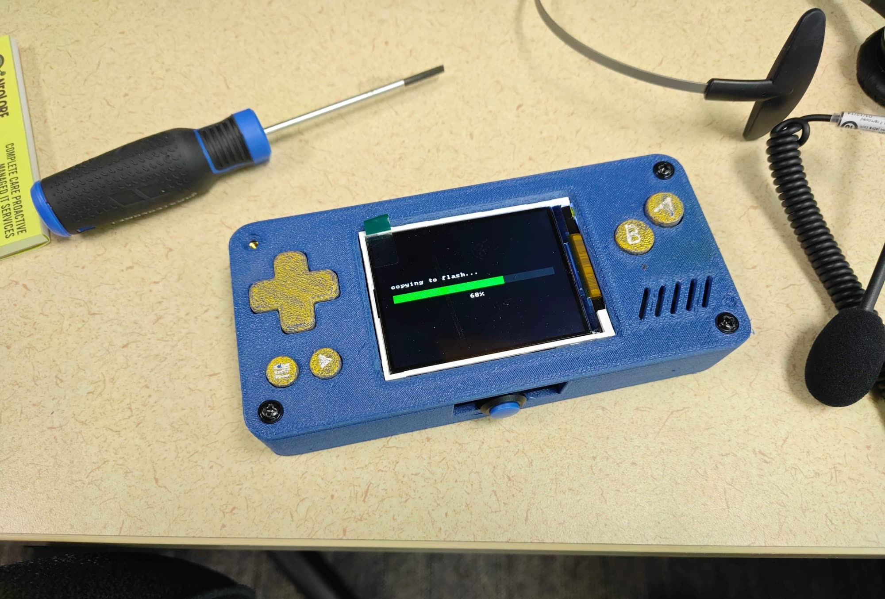
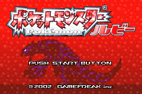
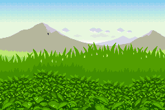
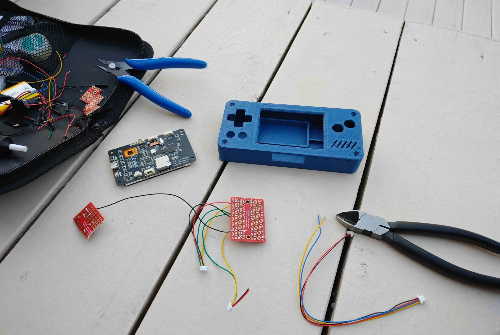
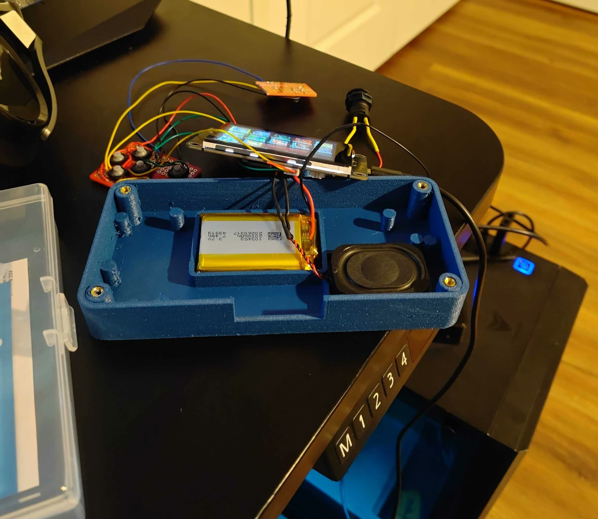

# esp-gba — a GBA / GB / GBC handheld on an ESP32-S3



| | | |
|---|---|---|
|  |  |  |

A pocket emulator console built on the Freenove FNK0104 board (ESP32-S3, 2.8"
ILI9341 320x240, ES8311 audio codec, SD slot, LiPo charging). It plays Game
Boy Advance titles with sound and correct rendering, and Game Boy /
Game Boy Color titles at a locked 60 fps.

Forked from [44vba](https://github.com/44670/44vba) (itself a
[vba-next](https://github.com/libretro/vba-next) fork); GB/GBC support is
[gnuboy](https://github.com/rofl0r/gnuboy) as vendored by
[retro-go](https://github.com/ducalex/retro-go).

## Features

- **GBA** via vba-next with a native (HLE) m4a audio mixer and idle-loop
  skip, both discovered per cart by scanning (no game tables to maintain).
  Rendering is verified-correct (screenshot-audited); 9-35 fps depending
  on title and scene, with the speed work ongoing.
- **GB / GBC** via gnuboy at a locked 60 fps, scaled 1.5x to 240x216.
- **Sound** through the board's ES8311 codec + speaker, rate-matched to the
  emulator's real speed so audio never crackles or drifts.
- **Game library menu** with box art from the SD card, button navigation,
  battery/charge readout, and a settings screen.
- **Saves**: GBA save flash persists to `/sd/saves/<game>.sav`; GB cart SRAM
  autosaves to `/sd/saves/<game>.srm`.
- **Charging indicator**: `CHG` in the menu footer (and a `+` next to the
  in-game battery gauge) whenever USB power is present.
- **Physical controls only** in-game: a 2x4 button matrix covers the full
  GBA pad, including L/R via Select-combos.

## Parts list

What one unit is built from:

| Part | Notes |
|---|---|
| ESP32-S3 2.8" LCD dev board | "2.8 LCD Display ESP32-S3 240x320 Capacitive Touch" (Freenove FNK0104-class / CYD variant): ESP32-S3 R8, 16 MB flash, 8 MB PSRAM, ILI9341 panel, ES8311 codec, SD slot, TP4054 charger |
| LiPo battery | 103450 3.7 V 2000 mAh (7.4 Wh) |
| Speaker | small 8 Ω oval, driven by the board's SC8002B amp |
| Tactile switches ×8 | D-pad ×4, A, B, Select, Start — on solderable mini breadboards / custom PCB |
| Hook-up wire + JST connectors | button matrix and battery leads |
| 3D-printed case | models in [hardware/case/](hardware/case/) |
| M2/M2.5 heat-set inserts + screws | case assembly |

Custom PCBs and printable case models live under [hardware/](hardware/).

## Build photos

| Parts | Assembly |
|---|---|
|  |  |

## Hardware

| Part | Detail |
|---|---|
| Board | Freenove FNK0104 (ESP32-S3, 16 MB quad flash, 8 MB octal PSRAM) |
| Screen | 2.8" ILI9341, 320x240, SPI at 55 MHz (59.6 under overclock) |
| Audio | ES8311 codec + SC8002B amp, I2S |
| Storage | micro-SD (SDMMC 4-bit) for ROMs, art, and saves |
| Power | LiPo + on-board TP4054 charger (~100 mA) |
| Buttons | 2x4 matrix on free GPIOs — rows 2/3, columns 14/21/43/44 |

Wiring: see [WIRING.md](WIRING.md) and the diagram in
[docs/button_wiring.svg](docs/button_wiring.svg). Each button simply bridges
its row pin to its column pin; rows are open-drain, columns use internal
pull-ups, no external resistors needed.

## Controls

The console has 8 physical buttons (D-pad, A, B, Start, Select) plus the
board's BOOT button on the bottom edge. The GBA's shoulder buttons have no
physical switches — they are **Select-combos**, which gen-3 Pokémon (and
most GBA games) only use for optional shortcuts:

**In game**

| Input | Action |
|---|---|
| D-pad / A / B / Start / Select | the GBA pad, 1:1 |
| **Select + Left** (hold Select, tap Left) | **L shoulder** |
| **Select + Right** (hold Select, tap Right) | **R shoulder** |
| Select + Up | toggle the fps/debug overlay strip |

A short Select press on its own still reaches the game (menus, party
switching) — the combo only fires while a direction is pressed with it.

**In the game picker**

| Input | Action |
|---|---|
| D-pad | move the selection |
| A or Start | play the highlighted game |
| Select (or the gear icon by touch) | settings: volume, debug overlay, overclock, native audio |
| Touch: left/right screen edge | previous/next library page |
| BOOT button short press | next game (for units without the button matrix) |
| BOOT button long press | play |

**In settings**: Up/Down select a row, A toggles, Left/Right adjust the
volume, B goes back. All settings persist across power cycles.

Nothing auto-starts: the console always boots to the picker and waits.

## SD card layout

```
/roms/     game files: .gba, .gb, .gbc
/art/      optional box art: <rom name without extension>.raw
           (48x48 RGB565 big-endian; tools/scrape_art.py fetches these)
/saves/    created automatically
/packed/   pack cache, created automatically (safe to delete)
```

## Build & flash

**Step-by-step for Linux and Windows: [FLASHING.md](FLASHING.md).** Short
version, once [PlatformIO](https://platformio.org) is installed:

```bash
python tools/flash_qio.py
```

Never use `pio run -t upload`: this board needs a DIO-patched bootloader
with the QIO app, which the script handles (details in
[README-esp-gba.md](README-esp-gba.md)).

For a factory-fresh state (default settings), also erase NVS once:

```bash
pio pkg exec -p tool-esptoolpy -- esptool.py --chip esp32s3 --port /dev/ttyACM0 erase_region 0x9000 0x6000
```

## Performance notes

The native audio mixer (default on) plus an optional 278 MHz overclock
(default off; settings screen; engages ~10 s into gameplay and never in
the menu) run gen-3 Pokémon at 50-60 fps at stock clocks, with rendering
verified correct frame-by-frame. Faster renderer
paths exist in-tree but are unrouted until they pass the same
screenshot audit that caught them rendering white. The overclock
overdrives the shared PLL, which also pushes the flash clock ~8% out of
spec — safe for reads, but not for writes — so the firmware automatically
drops to stock around every flash/NVS write (game copies, settings saves)
and re-engages afterwards. It can be turned off in the settings screen;
all settings persist in NVS across power cycles.

A serial control channel (1.5 Mbaud on the USB port, `0xA5`-framed commands
in `port-esp32s3/main/os.h`) supports scripted picks, benchmarks, screenshots,
file push, and live tuning — everything `tools/*.py` uses.

## Repository layout

```
src/, libretro*/      vba-next core (GBA)
components/gnuboy/    gnuboy core (GB/GBC)
port-esp32s3/         this port: display, audio, SD, menu, input, serial
tools/                flash script, benchmark/screenshot/art tooling
docs/                 wiring diagram, dev logs (docs/devlog/)
port-sdl2/            44vba's desktop port, kept as the reference implementation
```

## Compatibility

Every game below was packed, byte-verified, booted, played past its title
with real input, and screenshot-checked by the automated suite
(`emu` fps in menu/attract scenes, stock 240 MHz):

| Game | fps | Game | fps |
|---|---|---|---|
| Pokémon FireRed (US 59.7 / JP 59.1) | ~60 | Sonic Advance 2 | 34 |
| Pokémon Ruby (US) | 58.9 | Metroid Fusion | 32 |
| Golden Sun | 57.9 | Mario Kart Super Circuit | 31 |
| Metroid Zero Mission | 55.5 | Zelda: The Minish Cap | 22 |
| Pokémon Emerald (US/JP) | 47-55 | FFVI Advance | 16 |
| Pokémon LeafGreen (JP) | 52.4 | Aria of Sorrow | 16 |
| | | Kirby / Advance Wars / SMA4 | 11-13 |

GB/GBC titles run at a locked 60. Any cart fits whose *distinct* 64 KB
pages number ≤ 229 — identical padding pages are stored once, which is how
16 MB carts fit in the 14.4 MB rom partition. The one known exception is
Fire Emblem (US): 16 MB of pure unique content, refused with an on-screen
message rather than truncated.

## Credits

- [44670/44vba](https://github.com/44670/44vba) — the ESP32 port this grew from
- [libretro/vba-next](https://github.com/libretro/vba-next) — the GBA core
- [ducalex/retro-go](https://github.com/ducalex/retro-go) — the gnuboy fork used for GB/GBC
- Freenove — FNK0104 board documentation

Development history, measurements, and the reasoning behind every port
decision live in [docs/devlog/](docs/devlog/).
